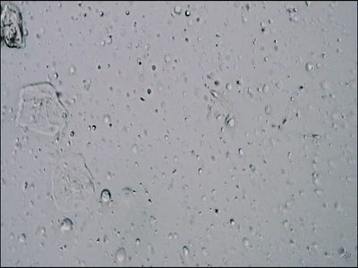

# yo_pull

Tools to view and record live video from a **YO v2.0** home sperm-test device on a Mac.

The camera looks through a counting slide; either the original or you can make one yourself (see below). Recordings can be used to visually inspect sperm and estimate concentration from manual counts.

Useful for rapid at-home testing to try different collection or processing methods or whatever else you want to experiment with. The Yo! app is annoying; it makes you wait for 10 minutes and click dozens of times, this tool avoids that.

## Sample recording

Three sperm visible in an ~8 s clip from the live feed:

<!-- GitHub strips relative paths in <video>; MP4 is hosted on the demo-assets release -->
<p align="center">
  <video
    src="https://github.com/uhgall/yo_pull/releases/download/demo-assets/3sperms.mp4"
    poster="3sperms.gif"
    controls
    muted
    playsinline
    width="640">
    
  </video>
  <br>
  <sub><a href="3sperms.mp4">Full clip in repo (MP4)</a></sub>
</p>

[My semen is so bad that I had to search a bit on the slide... You can pull it out a little bit which obviously shifts the field of view. That part of the video was sped up... the 3 swimmers you can actually see at the end are what it looked like in real time, for my not-so-great material]

## Quick start

1. Install ffmpeg: `brew install ffmpeg`
2. Power on the YO device and join its **Yo2** WiFi network on your Mac.
3. View and record live video:

```bash
python3 yo_view.py
```
With no slide inserted, you'll see a black screen because the built-in light only gets activated when you push in a slide.

4. Pull saved clips off the device (not actually very useful tbh):

```bash
python3 yo_pull.py setup
python3 yo_pull.py ftp-grab --out ~/Desktop/yo_videos
```

Press `q` in the viewer window to stop recording. Output defaults to `./yo_live_<timestamp>.mp4`.

## Scale

Calibrated from a reference image (the 0.2mm grid netting we use at www.cocovivo.com to keep the no-see-ums out, that's all I had, haha).

- **400 pixels = 0.2 mm**

| Quantity | Value |
|---|---|
| µm per pixel | **0.5 µm/px** |
| px per mm | **2000 px/mm** |

So with the **640×480** video size, the full field of view is about:

- width: **0.32 mm** (640 px)
- height: **0.24 mm** (480 px)
- area: **0.0768 mm²**

### Slide gap

I think the original YO slide has a **0.1 mm** sample gap (chamber depth). I vaguely validated it and it's also the medical standard (Makler chamber so I think that's right. A DIY slide using **80 gsm paper** as the spacer hits roughly the same depth (see [Making your own slide](#making-your-own-slide)).

With that, you get the sperm count per mL by conting the sperm in the frame and dividing by about 8. (7.7, actually)

### 1. How big should a sperm look?

| Part | Real size | Expected size in video |
|---|---|---|
| Head length | ~4–5 µm | **~8–10 px** |
| Head width | ~2.5–3 µm | **~5–6 px** |
| Full cell (head + tail) | ~50–60 µm | **~100–120 px** |

In a 640 px-wide frame:

- A sperm **head** is a small dot — roughly **1–2% of frame width**.
- A full motile sperm with tail can span up to **~15–20% of frame width**.
- Objects much wider than **~15 px** are probably debris, bubbles, or clumps, not individual heads.

## 2. Converting a slide count to M sperm/mL

**M sperm/mL** means **millions of sperm per millilitre** (same unit the YO app reports).

Count **N** sperm in a region of known area **A** (mm²). With slide gap **d = 0.1 mm**:

```
M sperm/mL = N / (A × d × 1000)
           = N / (A × 100)
```

Using the whole visible field (`A = 0.0768 mm²`, `d = 0.1 mm`):

```
M sperm/mL ≈ N / 7.7
```

Example: **40 sperm** in the full frame → about **5.2 M/mL**.

### Typical reference range

Normal semen is often quoted around **15–200 M/mL**, with many fertile samples in the **40–80 M/mL** range.

## Making your own slide

The YO device is just a microscope over a thin sample chamber. The original slide is a precision spacer; you can approximate one with a standard microscope slide, a cover glass, and something inbetween for the spacing.

### Gap spacer: 80 g/m² paper

Normal **80 g/m²** (80 gsm) copy paper is about **0.1 mm** thick — close enough to the original slide gap to use the concentration formulas above. But it absorbs liquids, obviously, so that's a downside.

Other spacer options:

| Material | Typical thickness |
|---|---|
| Clear packing tape / carton sealing tape | 0.04–0.07 mm |
| Heavy-duty packing tape | 0.07–0.09 mm |
| Electrical PVC tape | 0.13–0.18 mm |
| Good-quality electrical tape, e.g. 3M Super 33+ class | ~0.18 mm |
| Cheap thin electrical tape | ~0.10–0.13 mm |

80 gsm paper (~0.1 mm) sits in the middle of this range and is a good default. Thinner tape gives a shallower chamber and may focus better but shifts your concentration math; thicker tape blurs more and also changes `d` — plug the actual thickness into `M sperm/mL = N / (A × d × 1000)`.

### Tips

- **Match the original slide geometry** as much as possible. Obviously you need to make sure the sample is in the same spot as on the original slide. Also, the light inside the microscope is activated by pushing in the slide, so make sure it actually activates.
- **Thicker gap = worse focus.** The camera has limited depth of field; a gap much above ~0.1 mm will look soft and sperm will be harder to see and count. Stick to one sheet of 80 gsm paper.
- **Avoid bubbles** under the cover glass — they dominate the image and ruin counts.

This is a rough substitute, not a clinical-grade chamber (no shit!).

## Files

| File | Purpose |
|---|---|
| `yo_view.py` | Live view + record from RTSP |
| `yo_pull.py` | Download clips from device (HTTP/FTP/API) |

## Trimming recordings

LosslessCut is the easiest GUI option for time-cropping MP4s on macOS:

```bash
brew install --cask losslesscut
```

Or with ffmpeg:

```bash
ffmpeg -ss 00:00:05 -to 00:00:20 -i yo_live_20260621_002523.mp4 -c copy cropped.mp4
```

## TODO

Obviously the counting an evaluating should be done by AI these days.

Should get a proper slide with a marked fine grid to get a more accurate formula. 

Find a source for the sample slides, they're annoying to fabricate. 